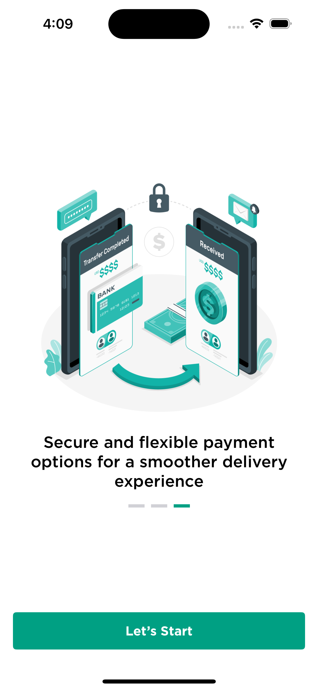
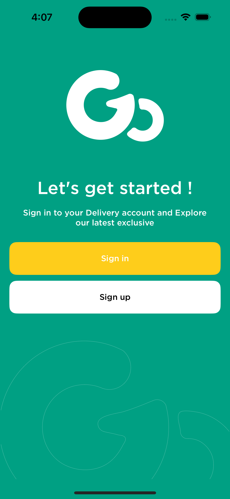
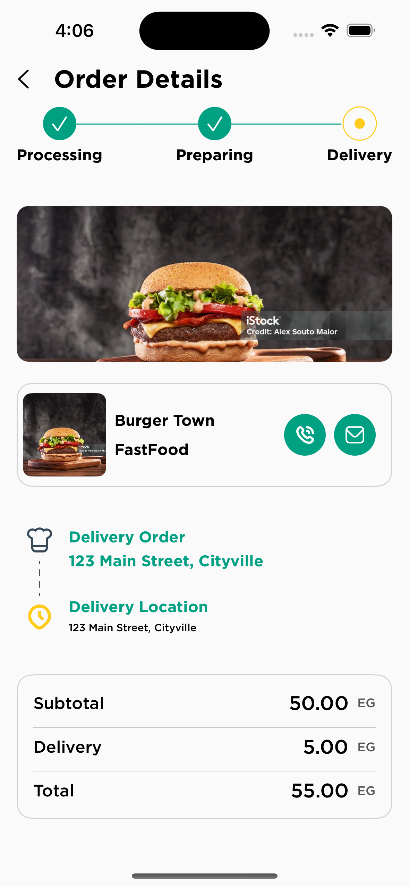

# Mini Food Delivery Tracking App

## 📱 Overview
A lightweight food delivery tracking app built with SwiftUI and MVVM. It displays orders and tracks real-time updates via WebSocket.

## Architecture

1. SwiftUI + MVVM
2. Combine for state
3. REST + WebSocket via URLSession
4. Manual Dependency Injection

## 🔧 Setup Instructions

1. Clone the repo
2. setup mocked api using "Mockoon Application" drag FoodDeliveryMockApi.json from Application files to Mockoon and run local server 
3. Run the app

## 🚀 Mock Server

http://localhost:3000

### Endpoints:

- POST /register (for user registration)
- POST /login (for user authentication)
- GET /orders (list all orders)
- GET /order/{id} (get details for a specific order)
- POST /orders (create a new order)
- GET /profile (get user profile)
- PUT /profile (update user profile)
- WS: ws://localhost:8080/orders/updates

## 📱 Screenshots

  
  

  
  

  
  

  
  

  
  

  
  

  
  

